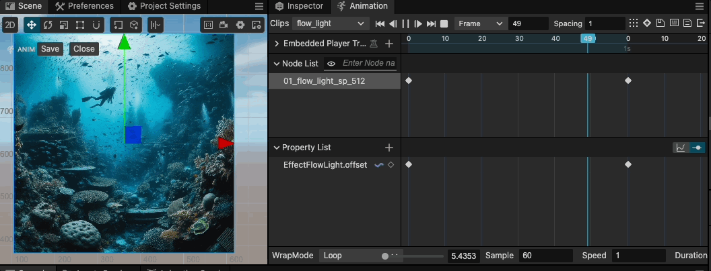
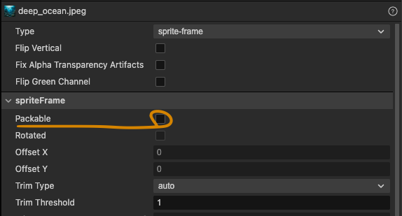
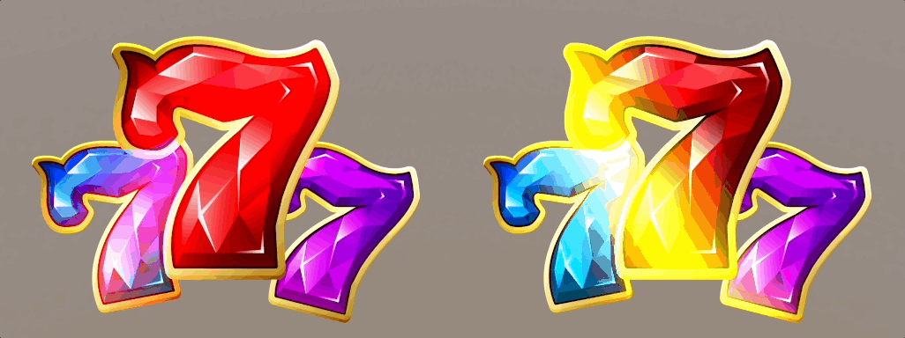
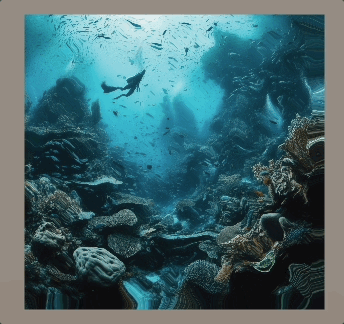
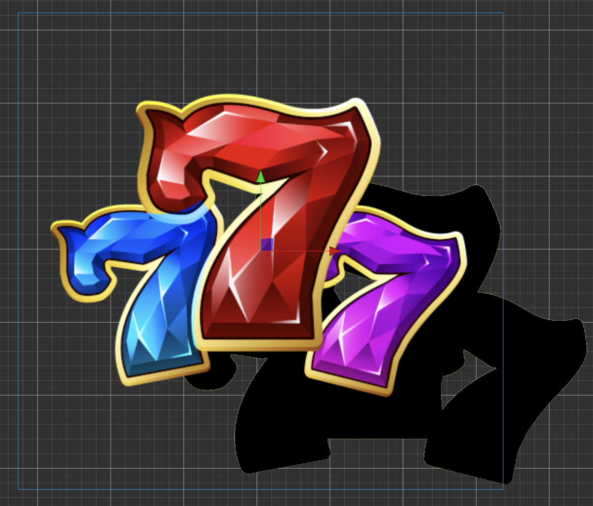
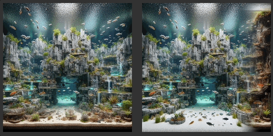

# CC3.SpriteEffect 

  

  

語言(Language) [CN](./README.md) | EN

This project was inspired by [Unity mob-sakai's UIEffect](https://github.com/mob-sakai/UIEffect) and aims to develop custom sprite effect for CocosCreator 3.8+.

>"Don’t just pass by, give it a try—hit a star and show your support!"

<p align="center"></p>

<p align="center"></p>


## Installation
Sprite Effect is an extension package for CocosCreator 3.8+ and needs to be installed in the extensions folder. The steps are as follows:

>1. Clone the Git repository
>2. Unzip the package and place it in "${PROJECT_FOLDER}/extensions/sprite_effect"
>3. cd "${PROJECT_FOLDER}/extensions/sprite_effect"
>4. npm install
>5. npm run build
>6. Start the CocosCreator Editor
>7. Click on "Extension" in the menu bar and go to the Extension Manager.
>8. Select the "Installed" tab, and see the "sprite_effect" extension here.

## How to Use

1. Select the node which you want to add the effect component.
2. Click the "Add Component button" and choose the effect you want.

> ATTENTION: Sometimes the effect may not show correctly the first time the component is added. Press the "Reload button" in the effect component's inspector to reload the effect and cirrect this issue.

## Demo Project

All the demo of effect are hosted at [https://github.com/BricL/CC3.SpriteEffect.DemoProject](https://github.com/BricL/CC3.SpriteEffect.DemoProject).

<p align="center"></p>

## Notes
### 2D-Rendering-in-3D (RenderRoot2D Component)

The RenderRoot2D component allows the 2D sprite to be rendered in 3D space to acrchive a 3D UI. The rendering order follows the same rules as the Canvas, and the depth order with other 3D object is determined by the z-buffer. Therefore, the Depth Test needs to be enabled.

The Sprite Effect supports an easy way to enable the Depth Test by following the steps bellow:

<p align="center"></p>

### Disable the automatic atlas packing

If the Packable option is enabled in the texture importer, the automatic packing process will generate an atlas that reassigns the UV positions for sprites, leading to incorrect UV calculations.

<p align="center"></p>
    

## All Effect List：

0. [Effect Color](#effect-color)
1. [Effect Flow Light](#effect-flow-light)
2. [Effect Distort](#effect-distort)
3. [Effect Gaussian Blur](#effect-gaussian-blur)
4. [Effect Shadow](#effect-shadow)
5. [Effect Water Surface](#effect-water-surface)
6. [Effect Disappear](#effect-disappear)
7. [Effect Wave](#effect-wave)
8. [Effect Dissolve](#effect-dissolve)
9. [Effect Colorizing](#effect-colorizing)

## Effect Color

<p align="center"></p>

### Practical Approach

* Tone Mode
    * GRAY
        
        ``` GLSL
        float gray  = 0.2126 * o.r + 0.7152 * o.g + 0.0722 * o.b;
        ```

    * NEGA
        
        ``` GLSL
        float color = 1.0 - o.rgb
        ```

    * SEPIA
        
        A warm-toned brown, often used to describe the color tone in old photographs or paintings, calculated as follows:

        ``` GLSL
        o = vec4(dot(o.rgb, vec3(0.393, 0.769, 0.189)), 
                dot(o.rgb, vec3(0.349, 0.686, 0.168)), 
                dot(o.rgb, vec3(0.272, 0.534, 0.131)), 
                o.a)
        ```

* Color Mode

    * Perform common operations ADD, SUB, MUT and FILL between the specified color and the sprite color.

* Blur Mode

    * Use a one-pass Gaussian blur to achieve the blur effect on the sprite. For detailed algorithm, please refer to EffectGaussian.

## Effect Flow Light

<p align="center"></p>

### Practical Approach

* Flow-Light

    * Use the SmoothStep function to generate the flow-light texture, then add it to the sprite color.

        ```GLSL
        float c = smoothstep(_lightWidth, _lightWidth - _soft, abs(uv.x + _offset));
        o = (o * color) + vec4(_lightColor.rgb * c * 1.5, 0.0);
        ```

        <p align="center"></p>

    * The definition of SmoothStep function is as follows:

        $$
        smoothstep(edge0, edge1, x) = 0, \text{ if } x \leq edge0
        $$

        $$
        smoothstep(edge0, edge1, x) = 1, \text{ if } x \geq edge1
        $$

        $$
        smoothstep(edge0, edge1, x) = t * t * (3 - 2 * t), \text{ where } t = \frac{x - edge0}{edge1 - edge0}, \text{ if } edge0 < x < edge1
        $$

* Rotate the flow-light

    * By using a 2D rotation matrix to rotate the UV coordinates, the direction of the flowing light can be changed.

        ```GLSL
        //以貼圖中心为旋转中心  
        vec2 uv = i_uv.xy - vec2(0.5, 0.5);

        //旋转矩阵公式 
        float s = sin(_rotation);
        float c = cos(_rotation);
        uv = vec2((uv.x * c - uv.y * s),  
                    (uv.x * s + uv.y * c));  

        //恢复纹理位置  
        uv += vec2(0.5, 0.5);  
        return uv;
        ```

## Effect Distort

<p align="center"></p>

### Practical Approach

* To create a flowing effect, use time variable to offset the UV coordinates. 
* Use the UV coordinates after applying the offset to sample the noise texture.
* Add the value of the noise texture to the original UV coordinates to approximate UV distortion.

    ```GLSL
    // 采样噪声纹理，根据时间计算偏移
    float px = mod(cc_time.x * _speed, 1.0);
    vec2 uv_offset_by_time = base_uv + px;
    uv_offset_by_time.x = mod(uv_offset_by_time.x, 1.0);
    uv_offset_by_time.y = mod(uv_offset_by_time.y, 1.0);

    // 利用Offset後的uv采样噪声纹理
    vec4 noise_uv = texture(_noisetex, uv_offset_by_time);

    // 將噪声纹理的值加到原始uv上，近似实现uv的扰动
    base_uv.xy += (noise_uv.xy) * _strength;
    base_uv = denormalizeUV(base_uv, _baseUV);
    ```

## Effect Gaussian Blur

<p align="center"></p>

### Practical Approach

* Use a 5x5 Gaussian kernal to process the blur. The algorithm steps as follows:

    <p align="center"></p>

    ```GLSL
    vec4 Tex2DBlurring(sampler2D tex, vec2 texcood, vec2 blur) {
        // 設定 5個 Kernel 權重值 (x、y方向都用同一組)
        const int BLUR_KERNEL_SIZE = 5;
        BLUR_KERNEL_[0] = 0.2486;
        BLUR_KERNEL_[1] = 0.7046;
        BLUR_KERNEL_[2] = 1.0;
        BLUR_KERNEL_[3] = 0.7046;
        BLUR_KERNEL_[4] = 0.2486;

        vec4 o = vec4(0.0);
        float sum = 0.0;
        vec2 offset = vec2(0.0);

        // 迴圈計算 5x5 個像素篇偏移
        for (int x = 0; x < BLUR_KERNEL_SIZE; x++) {
        offset.x = blur.x * (float(x) - float(BLUR_KERNEL_SIZE) / 2.0);

        for (int y = 0; y < BLUR_KERNEL_SIZE; y++) {
            offset.y = blur.y * (float(y) - float(BLUR_KERNEL_SIZE) / 2.0);
            
            // 對 x、y 方向權重相乘後，數值進行加總。
            float weight = BLUR_KERNEL_[x] * BLUR_KERNEL_[y];
            sum += weight;

            // 依據 uv offset 取出對應的像素顏色，並乘上對 x、y 方向權重的乘積
            vec2 uv = denormalizeUV(texcood + offset, _baseUV);
            o += texture(tex, uv) * weight;
        }
        }
        return o / sum;
    }
    ```

## Effect Shadow

### One-Pass Shadow (a.k.a Limited Bound shadow)

<p align="center"></p>

### Practical Approach

* Draw the shadow based on the shadow color, sprite alpha, and UV offset. Then use lerp to combine the shadow with the original sprite color.

* The advantage is speed, but the drawback is that the shadow range is limited by the size of the sprite.

    ```GLSL
    vec4 shadow = vec4(_shadowColor.rgb, texture(cc_spriteTexture, uv0 - _offset).a * _shadowColor.a);

    // lerp 在 GLSL 中叫 mix
    o = mix(shadow, o, o.a) * color;
    ```

### Two-Pass Shadow 

<p align="center"></p>

### Practical Approach

* This method is not limited by the size of the sprite, allowing for shadows at any distance, but it requires two passes to complete.

* Pass 1
    
    Use the uniform offset variable to apply an offset to the vertex positions in the vertex shader.

    ```GLSL
    CGProgram shadow-vs {
        uniform Constant {
            vec4 _shadowColor;
            vec2 _offset;
        };

        ...

        vec4 vert() {
            ...

            //Shadow 偏移
            pos.x += _offset.x; 
            pos.y += _offset.y;

            //將Shadow推離Camera一點距離，避免與下一個Pass的Sprite產生Z-fighting
            pos.z += 0.01;

            return pos;
        }
    }
    ```
* Pass 2
    
    Draw the sprite normally.

## Effect Water Surface

<p align="center"></p> 

### Water Flow Practical Approach

```GLSL
vec4 offset = texture(_noticeTex, uv0 + cc_time.w * _frequency);
vec2 uv1 = vec2 (uv0.x + cc_time.w * _flowDir.x * _speed, 
                 uv0.y + cc_time.w * _flowDir.y * _speed);
                       
o = texture(cc_spriteTexture, uv1 + offset.xy * _amplitude);
```

### Water Ripple Practical Approach

* Generate the Ripple Texture：
   * Centered on each UV coordinate
     
   * Sample `MAX_ITER` offset
     
   * Use UV + offset as sampling points
     
      * The offset function is a representation composed of `cos(x) + sin(x)`. 
      
        `(in: vec2) = vec2(cos(time - in.x) + sin(time + in.y), cos(1.5 * time + in.x) + sin(time - in.y))`
        
   * For each sampleing point, use the x and y components to compute `1/cos(x), 1/sin(y)`, forming a vec2.
     
   * Calculate the length of `vec2(1/cos(x), 1/sin(x))`
     
      * Take the reciprocal `1/length(vec2)`, so that sampling points further from the UV coordinate have a smaller impact on the brightness.
        
   * Sum the contributions of all sampling points to get the ripple brightness value.
     
* Combine the ripple texture with the sprite texture

    ```GLSL
    float calculateBrightness(vec2 uv)
    {
        vec2 noisePos = mod(uv * _density, _density) - 250.0;  // Calculate the position of the noise

        vec2 i = vec2(noisePos);  // Initialize i to the noise position
        float brightness = 1.0;  // Initialize brightness to 1.0
        float noiseIntensity = .0065;  // Noise intensity

        for (int iter = 0; iter < MAX_ITER; iter++)  // Loop MAX_ITER times
        {
            float timeFactor =  _speed * cc_time.x * (1.0 - (3.5 / float(iter+1)));  // Calculate time factor
            i = noisePos + vec2(cos(timeFactor - i.x) + sin(timeFactor + i.y), sin(timeFactor - i.y) + cos(1.5*timeFactor + i.x));  // Calculate new noise position
            brightness += 1.0 / length(vec2(noisePos.x / (cos(i.x+timeFactor)/noiseIntensity), noisePos.y / (cos(i.y+timeFactor)/noiseIntensity)));  // Calculate brightness
        }

        brightness /= float(MAX_ITER);  // Take the average
        brightness = 1.17-pow(brightness, 1.4);  // Calculate brightness value
        return pow(abs(brightness), 20.0); // Calculate color value
    }
    ```

## Effect Disappear

<p align="center"></p>

### Practical Approach

* Use the SmoothStep function
    * `t0 = _offset`
    * `t1 = t0 + _soft`，control the level of softness.
    * `uv0.y`，apply the effect in the vertical direction.

        ```GLSL
        float val = smoothstep(_offset, _offset + _soft, 1.0 - uv0.y);
        ```
    * As shown below:

    <p align="center"></p>

## Effect Wave

### Practical Approach

* The formula is as follows:

$$
d \cdot \sin\left(x\cdot a+b\right)
$$

* Use `uv.x `as the horizontal axis and apply the sine function, with `uv.y` representing the wave height.

    ```GLSL
    float value = _waveHeight * sin((_waveSpeed * cc_time.x) + (uv0.x * _waveWidth));
    float i = (uv0.y < _horizontalPlane + value) ? 0.0 : 1.0; 
    o *= i * color;
    ```

## Effect Dissolve

### Practical Approach

* Two SmoothStep functions are used as follows:

    * One for the edge color blend

    * One for alpha blend

    ```GLSL
    float alpha = texture(_noisetex, uv0).r;

    // Constants
    float width = _width * 0.25;
    float endgeBlend = smoothstep(0.0, _softness, (_effectFactor + width) - alpha);
    float alphaBlend = smoothstep(0.0, _softness, alpha - _effectFactor);

    // Edge blending & Adjust alpha
    o.rgb += _dissolveColor.rgb * endgeBlend;
    o.a *= alphaBlend;
    ```

## Effect Colorizing

<p align="center"></p>

### Practical Approach

* Grayscale the sprite.

* Use the grayscale values to remap each channel with 'invLerp' to the Min ~ Max range of each channel.

    ```GLSL
    o *= CCSampleWithAlphaSeparated(cc_spriteTexture, uv0);
    float gray  = 0.2126 * o.r + 0.7152 * o.g + 0.0722 * o.b;
    o.r = o.g = o.b = gray;

    o = vec4(invLerp(rChannel.x, rChannel.y, gray), 
             invLerp(bChannel.x, bChannel.y, gray), 
             invLerp(gChannel.x, gChannel.y, gray), 
             o.a);
    ```

## References

* [Untiy mob-sakai UIEffect](https://github.com/mob-sakai/UIEffect)

* [ccc3UIShaderBatch](https://github.com/bakabird/ccc3UIShaderBatch)

* [CocosCreator3.x 应用在UI(Sprite) 上的 shader(.effect) 的合批，通过自定义顶点参数](https://forum.cocos.org/t/topic/153963)

* [Functional Shaders: A Colorful Intro-Part5 Tinting With Sepia Tone](https://medium.com/@rupertontheloose/functional-shaders-a-colorful-intro-part5-tinting-with-sepia-tone-cd6c2b49806)

* [Desmos](https://www.desmos.com/calculator?lang=zh-TW)
