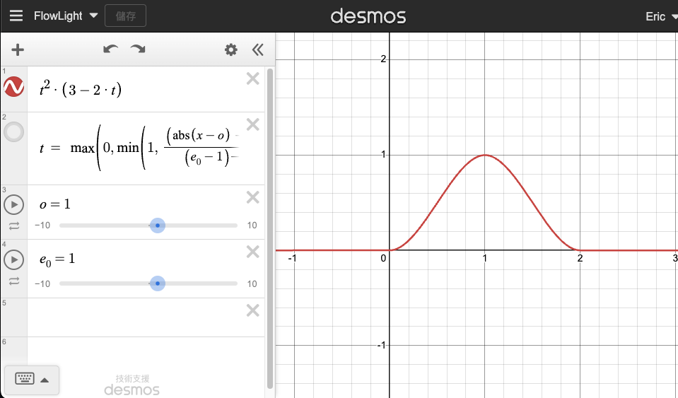

# CC.SpriteEffect
受 [Untiy mob-sakai UIEffect](https://github.com/mob-sakai/UIEffect) 啟發，針對 Cocos Creator 3.8.x 開發的 Sprite Effect 組件。

<p align="center"></p>

<p align="center"></p>

## 使用方式

1. 選取欲添加 Effect 的 Sprite Node。
2. 點擊Add Component，選擇想要的 Effect。

> :warning: 注意！Cocos Creator 3.x.x 有時指定 effect 後效果不會出現，目前的解決方法是手動點擊 Component 上的 reload，強制 Editor 重新讀取 effect。 


## 安裝方法
Sprite Effect 採用 CC3.8 後的 extension 開發，故專案要安裝在擴展的資料夾下，安裝步驟如下：

>1. 下載 git 包
>2. 解壓縮至項目資料夾([project_folder]/assets，同層)下的 extenstions/sprite_effect
>3. cd [project_folder]/extensions/sprite_effect
>4. npm install
>5. 啟動 Cocos Creator
>6. 至 Extension 頁籤，啟動 Extension Manager
>7. 選擇 installed，就會看件 sprite_effect 的功能 (如果沒有，可以按下旁邊的 Reflash Extensions List)


## 注意事項

### RenderRoot2D Component

在 CC 中 RenderRoot2D 組件可讓 Sprite 於 3D 空間中呈現，達到 3D UI 的效果。而組件下子節點渲染順序與 Canvas 規則相同，但與其他 3D 物件的深度順序，需要開啟 Material 中的深度測試 (Depth Test)。

Effect Component 提供了簡單的設定，開啟方式如下：

<p align="center"></p>

### 取消圖集自動的包 (Packable)

<p align="center"></p>

* 理由
    
    啟用自動打包會在遊戲打包時，自動產生的圖集給予 sprite 新的 uv 位置，導致相關的 uv 計算錯誤。（除非官方可以提供相關的 shader function，否則很難解決這問題）

# 各 Effect 實作思路：

0. [Effect Color](#effect-color)
1. [Effect Flow Light](#effect-flow-light)
2. [Effect Distort](#effect-distort)
3. [Effect Gaussian Blur](#effect-gaussian-blur)
4. [Effect Shadow](#effect-shadow)
5. [Effect Water Surface](#effect-water-surface)
6. [Effect Disappear](#effect-disappear)
7. [Effect Wave](#effect-wave)
8. [Effect Dissolve](#effect-dissolve)
9. [Effect Colorizing](#effect-colorizing)

## Effect Color

<p align="center"></p>

### 實作思路

* Tone Mode
    * GRAY (顏色灰階)
        
        ``` GLSL
        float gray  = 0.2126 * o.r + 0.7152 * o.g + 0.0722 * o.b;
        ```

    * NEGA (顏色反轉)
        
        ``` GLSL
        float color = 1.0 - o.rgb
        ```

    * SEPIA (棕色舊化)
        
        一种带有暖色调的棕色，常用于描述古老的照片或者画作中的色调，計算如下：

        ``` GLSL
        o = vec4(dot(o.rgb, vec3(0.393, 0.769, 0.189)), 
                dot(o.rgb, vec3(0.349, 0.686, 0.168)), 
                dot(o.rgb, vec3(0.272, 0.534, 0.131)), 
                o.a)
        ```

* Color Mode

    * 針對指定顏色與Sprite上顏色進行常用的ADD(相加)、SUB(相減)、MUT(相乘)、FILL(填色)處理。

* Blur Mode

    * 採用快速的One-Pass高斯模糊進行處理。詳細算法請見EffectGaussian。

## Effect Flow Light

<p align="center"></p>

### 實作思路

* 流光貼圖

    * 利用 SmoothStep function 產生流光貼圖，再與 Sprite 顏色相加。

        ```GLSL
        float c = smoothstep(_lightWidth, _lightWidth - _soft, abs(uv.x + _offset));
        o = (o * color) + vec4(_lightColor.rgb * c * 1.5, 0.0);
        ```

        <p align="center"></p>

    * SmoothStep數學定義如下：

        $$
        smoothstep(edge0, edge1, x) = 0, \text{ if } x \leq edge0
        $$

        $$
        smoothstep(edge0, edge1, x) = 1, \text{ if } x \geq edge1
        $$

        $$
        smoothstep(edge0, edge1, x) = t * t * (3 - 2 * t), \text{ where } t = \frac{x - edge0}{edge1 - edge0}, \text{ if } edge0 < x < edge1
        $$

* 流光旋轉

    * 利用2D旋轉矩陣，對uv座標進行轉動，便可達成轉動流光的方向。

        ```GLSL
        //以貼圖中心为旋转中心  
        vec2 uv = i_uv.xy - vec2(0.5, 0.5);

        //旋转矩阵公式 
        float s = sin(_rotation);
        float c = cos(_rotation);
        uv = vec2((uv.x * c - uv.y * s),  
                    (uv.x * s + uv.y * c));  

        //恢复纹理位置  
        uv += vec2(0.5, 0.5);  
        return uv;
        ```

## Effect Distort

<p align="center"></p>

### 實作思路

* 要形成流動的效果，就對 uv 進行 "時間" 上的偏移。
* 利用Offset後的uv采样噪声纹理
* 將噪声纹理的值加到原始uv上，近似实现uv的扰动。

    ```GLSL
    // 采样噪声纹理，根据时间计算偏移
    float px = mod(cc_time.x * _speed, 1.0);
    vec2 uv_offset_by_time = base_uv + px;
    uv_offset_by_time.x = mod(uv_offset_by_time.x, 1.0);
    uv_offset_by_time.y = mod(uv_offset_by_time.y, 1.0);

    // 利用Offset後的uv采样噪声纹理
    vec4 noise_uv = texture(_noisetex, uv_offset_by_time);

    // 將噪声纹理的值加到原始uv上，近似实现uv的扰动
    base_uv.xy += (noise_uv.xy) * _strength;
    base_uv = denormalizeUV(base_uv, _baseUV);
    ```

## Effect Gaussian Blur

<p align="center"></p>

### 實作思路

* 採用 5x5 的 Kernel 進行模糊處理，演算步驟如下：

    <p align="center"></p>

    ```GLSL
    vec4 Tex2DBlurring(sampler2D tex, vec2 texcood, vec2 blur) {
        // 設定 5個 Kernel 權重值 (x、y方向都用同一組)
        const int BLUR_KERNEL_SIZE = 5;
        BLUR_KERNEL_[0] = 0.2486;
        BLUR_KERNEL_[1] = 0.7046;
        BLUR_KERNEL_[2] = 1.0;
        BLUR_KERNEL_[3] = 0.7046;
        BLUR_KERNEL_[4] = 0.2486;

        vec4 o = vec4(0.0);
        float sum = 0.0;
        vec2 offset = vec2(0.0);

        // 迴圈計算 5x5 個像素篇偏移
        for (int x = 0; x < BLUR_KERNEL_SIZE; x++) {
        offset.x = blur.x * (float(x) - float(BLUR_KERNEL_SIZE) / 2.0);

        for (int y = 0; y < BLUR_KERNEL_SIZE; y++) {
            offset.y = blur.y * (float(y) - float(BLUR_KERNEL_SIZE) / 2.0);
            
            // 對 x、y 方向權重相乘後，數值進行加總。
            float weight = BLUR_KERNEL_[x] * BLUR_KERNEL_[y];
            sum += weight;

            // 依據 uv offset 取出對應的像素顏色，並乘上對 x、y 方向權重的乘積
            vec2 uv = denormalizeUV(texcood + offset, _baseUV);
            o += texture(tex, uv) * weight;
        }
        }
        return o / sum;
    }
    ```

## Effect Shadow

### One-Pass Shadow (a.k.a Limited Bound shadow)

<p align="center"></p>

### 實作思路

* 在 Pixel Shader 下，根據設定 Shadow 的顏色(RGB)、Sprite Alpha，加上對 uv 的偏移量(Offset)繪製出 Shadow，再將其結果與 Sprite 原來的顏色進行lerp。

    ```GLSL
    vec4 shadow = vec4(_shadowColor.rgb, texture(cc_spriteTexture, uv0 - _offset).a * _shadowColor.a);

    // lerp 在 GLSL 中叫 mix
    o = mix(shadow, o, o.a) * color;
    ```

* 該方法的缺點就是偏移量會被 Sprite 的大小所限制，但優點是速度快。

### Two-Pass Shadow 

<p align="center"></p>

### 實作思路

* 此方法不受限於Sprite的大小範圍，可任意距離的shadow，但需要兩個Pass來完成。

* Pass 1
    
    將 Uniform 的 Offset 參數在 Vertex Shader 中對頂點(Vertex)進行偏移。

    ```GLSL
    CGProgram shadow-vs {
        uniform Constant {
            vec4 _shadowColor;
            vec2 _offset;
        };

        ...

        vec4 vert() {
            ...

            //Shadow 偏移
            pos.x += _offset.x; 
            pos.y += _offset.y;

            //將Shadow推離Camera一點距離，避免與下一個Pass的Sprite產生Z-fighting
            pos.z += 0.01;

            return pos;
        }
    }
    ```
* Pass 2
    
    正常繪製Sprite圖。

## Effect Water Surface

<p align="center"></p>

### Water Flow 

### 實作思路

```GLSL
vec4 offset = texture(_noticeTex, uv0 + cc_time.w * _frequency);
vec2 uv1 = vec2 (uv0.x + cc_time.w * _flowDir.x * _speed, 
                 uv0.y + cc_time.w * _flowDir.y * _speed);
                       
o = texture(cc_spriteTexture, uv1 + offset.xy * _amplitude);
```

### Water Ripple

### 實作思路

* 計算 水波紋貼圖：
   * 以每個 UV 為中心
     
   * 取樣 MAX_ITER(這裡為5) 個偏移量
     
   * 以 UV + 偏移量成取樣點
     
      * 偏移量函數是一個 cos(x) + sin(x) 構成的表示式 (in: vec2) = vec2(cos(time - in.x) + sin(time + in.y), cos(1.5 * time + in.x) + sin(time - in.y))
        
   * 將取樣點的 x 與 y 分量，分別帶入 1/cos(x), 1/sin(y)，形成一個 vec2
     
   * 計算向量 vec2 長度 (1/cos(x), 1/sin(x))
     
      * 取倒數 1/length(vec2)，讓距離 UV 越遠的取樣點引響亮度越小
        
   * 將取樣的每個點進行加總成為水波亮度值
     
* 將 水波紋貼圖 ＋ Sprite 貼圖，得到結果

    ```GLSL
    float calculateBrightness(vec2 uv)
    {
        vec2 noisePos = mod(uv * _density, _density) - 250.0;  // Calculate the position of the noise

        vec2 i = vec2(noisePos);  // Initialize i to the noise position
        float brightness = 1.0;  // Initialize brightness to 1.0
        float noiseIntensity = .0065;  // Noise intensity

        for (int iter = 0; iter < MAX_ITER; iter++)  // Loop MAX_ITER times
        {
            float timeFactor =  _speed * cc_time.x * (1.0 - (3.5 / float(iter+1)));  // Calculate time factor
            i = noisePos + vec2(cos(timeFactor - i.x) + sin(timeFactor + i.y), sin(timeFactor - i.y) + cos(1.5*timeFactor + i.x));  // Calculate new noise position
            brightness += 1.0 / length(vec2(noisePos.x / (cos(i.x+timeFactor)/noiseIntensity), noisePos.y / (cos(i.y+timeFactor)/noiseIntensity)));  // Calculate brightness
        }

        brightness /= float(MAX_ITER);  // Take the average
        brightness = 1.17-pow(brightness, 1.4);  // Calculate brightness value
        return pow(abs(brightness), 20.0); // Calculate color value
    }
    ```

## Effect Disappear

<p align="center"></p>

### 實作思路

* 採用SmoothStep
    * t0 = _offset
    * t1 = t0 + _soft，控制柔和程度。
    * uv0.y，對垂直方向進行效果，也可以改為uv0.x對橫向進行效果。

        ```GLSL
        float val = smoothstep(_offset, _offset + _soft, 1.0 - uv0.y);
        ```
    * 如下圖所示：

    <p align="center"></p>

## Effect Wave

### 實作思路

* 基礎公式如下

$$
d \cdot \sin\left(x\cdot a+b\right)
$$

* 以uv.x為橫軸帶入sin，在以uv.y為水波高

    ```GLSL
    float value = _waveHeight * sin((_waveSpeed * cc_time.x) + (uv0.x * _waveWidth));
    float i = (uv0.y < _horizontalPlane + value) ? 0.0 : 1.0; 
    o *= i * color;
    ```

## Effect Dissolve

### 實作思路

* 兩個smoothstep

    * 一個負責edge color blend

    * 一個負責alpha blend

    ```GLSL
    float alpha = texture(_noisetex, uv0).r;

    // Constants
    float width = _width * 0.25;
    float endgeBlend = smoothstep(0.0, _softness, (_effectFactor + width) - alpha);
    float alphaBlend = smoothstep(0.0, _softness, alpha - _effectFactor);

    // Edge blending & Adjust alpha
    o.rgb += _dissolveColor.rgb * endgeBlend;
    o.a *= alphaBlend;
    ```

## Effect Colorizing

<p align="center"></p>

### 實作思路

* 對 Sprite 灰階化

* 利用灰階後的數值，對各通道 invLerp remap 至各通道的 Min ~ Max 區間。

    ```GLSL
    o *= CCSampleWithAlphaSeparated(cc_spriteTexture, uv0);
    float gray  = 0.2126 * o.r + 0.7152 * o.g + 0.0722 * o.b;
    o.r = o.g = o.b = gray;

    o = vec4(invLerp(rChannel.x, rChannel.y, gray), 
             invLerp(bChannel.x, bChannel.y, gray), 
             invLerp(gChannel.x, gChannel.y, gray), 
             o.a);
    ```

## 參考文獻

* [Untiy mob-sakai UIEffect](https://github.com/mob-sakai/UIEffect)

* [Functional Shaders: A Colorful Intro-Part5 Tinting With Sepia Tone](https://medium.com/@rupertontheloose/functional-shaders-a-colorful-intro-part5-tinting-with-sepia-tone-cd6c2b49806)

* [Desmos](https://www.desmos.com/calculator?lang=zh-TW)
