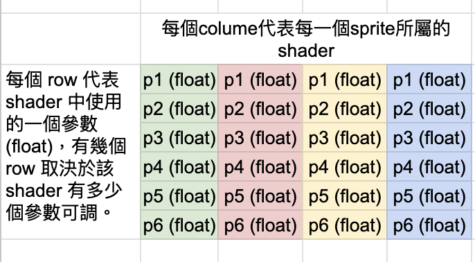

# UI(Sprite) 利用 Property Atlas 合批

依官方文件[【2D 渲染组件合批规则说明】](https://docs.cocos.com/creator/3.8/manual/zh/ui-system/components/engine/ui-batch.html#%E5%90%88%E6%89%B9%E6%96%B9%E6%B3%95%E8%AF%B4%E6%98%8E)，Sprite 一但使用 customMaterial 合批 (batch) 就會被拆分。而同 Shader 不同參數想合批，正統是將參數帶入頂點中。詳細做法論壇上的 bakabird 大大提供保母級的教程 [【分享】CocosCreator3.x 应用在UI(Sprite) 上的 shader(.effect) 的合批，通过自定义顶点参数](https://forum.cocos.org/t/topic/153963)。

但這方法需對 Sprite 的 4 種頂點宣告模式 (SIMPLE、SLICE、TILED、FILLED) 作實現。對我個人這種懶惰鬼來說是有那麼一點麻煩。

因此想到早期研發引擎時用過方法 `Propert Atlas` 將同 Shader 不同參數 pack 至一張貼圖，透過索引 (index) 於 Shader 取出所屬參數進行渲染，如此就能利用引擎本身的合批減少 drawcall。

對不同的 Shader 效果的參數還能有個統一的做法，想起來是不是有點甜?

### 實踐思路
* 一張 Shader `參數貼圖`，採用格式 RGBA32。
* 每個 Sprite 有代表自己的 index 傳入 Shader 中，以便取出自己所屬的參數。
* Component 依據 index 將參數存入`參數貼圖`中。

* 問題來了，如何產生 index 傳入 Shader 中？

  * 這裡用了點小心思，簡單的拿 Sprite.color 利用引擎原實作就綁定該屬性在頂點上當 index。

## 上代碼

* 繼承 Sprite Component

    ```typescript
    @ccclass('SpriteEffectBase')
    export class SpriteEffectBase extends Sprite { 
        ...
    }
    ```

* 建立一張 128x128 RGBA32F 的參數貼圖

    ```typescript
    @ccclass('SpriteEffectBase')
    export class SpriteEffectBase extends Sprite { 
        private static propsTexture: Texture2D | null = null;
        private static propBuffer: Float32Array | null = null;

        onLoad() {
            const w = 128;
            const h = 128;
            this.propBuffer = new Float32Array(w * h * 4);

            for (let y = 0; y < h; y++) {
                for (let x = 0; x < w; x++) {
                    const index = (x + (y * w)) * 4;
                    this.propBuffer[index] = 1;
                    this.propBuffer[index + 1] = 0;
                    this.propBuffer[index + 2] = 1;
                    this.propBuffer[index + 3] = 1;
                }
            }

            this.propsTexture = new Texture2D();
            this.propsTexture.setFilters(Texture2D.Filter.NEAREST,
                                         Texture2D.Filter.NEAREST);
            this.propsTexture.reset({
                width: w,
                height: h,
                format: Texture2D.PixelFormat.RGBA32F,
                mipmapLevel: 0
            });

            this.propsTexture.uploadData(this.propBuffer);
        }
        ...
    }
    ```

* 建立客制材質，綁定 `propsTexture` 指定至 customMaterial 參數

    ```typescript
    @ccclass('SpriteEffectBase')
    export class SpriteEffectBase extends Sprite {
        @property({ type: EffectAsset, tooltip: '指定效果EffectAsset' })
        public effectAsset: EffectAsset | null = null;
    
        private static propsTexture: Texture2D | null = null;
        private static propBuffer: Float32Array | null = null;

        onLoad() {
            ...
            let mat = new Material();
            mat.initialize(
                {
                    effectAsset: this.effectAsset,
                    defines: {},
                }
            );
            mat.setProperty('propsTexture', propsTexture);
            this.customMaterial = mat;
            ...
        }
        ...
    }
    ```

* 在 laterUpdate 時，若有參數有異動時進行更新

  ```typescript
  @ccclass('SpriteEffectBase')
  export class SpriteEffectBase extends Sprite {
      ...
      private static isDirty: boolean = false;
      ...
      lateUpdate(dt: number): void {    
            if (this.isDirty) {
                this.propsTexture.uploadData(this.propBuffer);
                this.isDirty = false;
            }
      }
  }
  ```

* 這個範例我們簡單定義一個 `effectColor` 傳入 Shader 中，對原 Sprite 進行顏色相加，代碼如下：

    ```GLSL
    CCEffect %{
        techniques:
        - name: default
            passes:
            - vert: sprite-vs:vert
            frag: sprite-fs:frag
            depthStencilState:
                depthTest: false
                depthWrite: false
            blendState:
                targets:
                - blend: true
                blendSrc: src_alpha
                blendDst: one_minus_src_alpha
                blendDstAlpha: one_minus_src_alpha
            rasterizerState:
                cullMode: none
            properties: &props
                alphaThreshold: { value: 0.5 }
                propsTexture: { value: white, editor: { type: sampler2D }}
    }%

    CCProgram sprite-vs %{
        precision highp float;
        #include <cc-global>
        #if USE_LOCAL
            #include <cc-local>
        #endif
        #if SAMPLE_FROM_RT
            #include <common/common-define>
        #endif
        
        in vec3 a_position;
        in vec2 a_texCoord;
        in vec4 a_color;

        out vec4 color;
        out vec2 uv0;

        vec4 vert () {
            ...
        }
    }%

    CCProgram sprite-fs %{
        precision highp float;
        #include <embedded-alpha>
        #include <alpha-test>
        #include <sprite-texture>
        #include "./chunks/util.chunk"

        in vec4 color; // 原 Sprite 屬性 color，用來當做 index 參數。
        in vec2 uv0;

        uniform sampler2D propsTexture;

        vec4 frag () {
            // [記住] Sprite 原始的 color 屬性已經被拿去當作 index。
            vec4 idx = color;
            vec4 effectColor = getPropFromPropTexture(propsTexture, idx, 0);

            // [小心思] index 編碼避免使用 a，因此會保留為 CC 中上一階 Canvas 透明 a，讓自定義的效果依然能正常受影響。
            effectColor = vec4(effectColor.rgb, effectColor.a * color.a); 

            vec4 o = vec4(1, 1, 1, 1);
            o = CCSampleWithAlphaSeparated(cc_spriteTexture, uv0);
            o = vec4(o.rgb + effectColor.rgb, o.a * effectColor.a);

            ALPHA_TEST(o);
            return o;
        }
    }%
    ```

* 屬性貼圖的儲存方式

    

    因此屬性貼圖`propsTexture`的 width 取決於一次能合批(batch)多少個 sprite，若為 64 代表最多可以一次合批(batch) 64 個獨立的 sprite，可依使用場景調整。

* Sprite.color 如何在 TS 中編碼

    ```typescript
    this.color = new Color(this._instanceID % PROP_TEXTURE_SIZE, // R Channel
                           pixelsUsage,                          // G Channel
                           PROP_TEXTURE_SIZE,                    // B Channel
                           255);                                 // A Channel
    ```

    * R通道 `this._instanceID`，代表這是這個 shader 的第幾個實體，可以想成多個 Sprite 使用同一個 shader，但都有自己的 shader 參數。

    * G通道 `PROP_TEXTURE_SIZE`，代表這張屬性貼圖的寬度大小。

    * B通道 `pixelsUsage`，一個 pixel 四個通道，代表四個 float 可使用，每個 float 都可以保存參數，而該 shader 的可調整參數有幾個，%4 代表使用了幾個 pixels。

    * A通道 `255`，設定為預設值，但不使用。

* Sprite.color 如何在 Shader 中解碼

    ```GLSL
    // 參數贴图中获取參數：
    // propTexture: 參數贴图
    // idxColor: 參數索引編碼
    // idxOfProps: 效果中的參數索引
    vec4 getPropFromPropTexture(sampler2D propTexture, vec4 encodeColor, int idxOfProps) {
        vec4 decodeColor = encodeColor * 255.0;
        vec2 prop_texture_uv = vec2(1.0/(decodeColor.r) * decodeColor.b, 
                                    1.0/(decodeColor.g) * float(idxOfProps));
        return texture(propTexture, prop_texture_uv);
    }
    ```

    * `encodeColor`，傳入的 Sprite.color。

    * `vec4 decodeColor = encodeColor * 255.0;`，將 0.0 ~ 1.0 轉換回 int 0 ~ 255 的 index。

    * 利用 `decodeColor` 計算出 `prop_texture_uv`，從 `propTexture` 中取出所屬的參數。

## 範例代碼

以上完整代碼放在 [CC3.SpriteEffect.DemoProject github](https://github.com/BricL/CC3.SpriteEffect.DemoProject) 中。

## 參考文獻
* [【分享】CocosCreator3.x 应用在UI(Sprite) 上的 shader(.effect) 的合批，通过自定义顶点参数](https://forum.cocos.org/t/topic/153963)

* [2D 渲染组件合批规则说明](https://docs.cocos.com/creator/3.8/manual/zh/ui-system/components/engine/ui-batch.html#%E5%90%88%E6%89%B9%E6%96%B9%E6%B3%95%E8%AF%B4%E6%98%8E)


